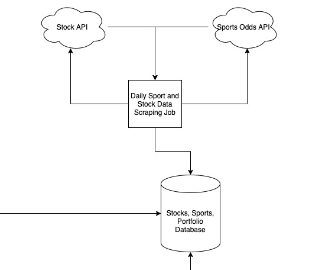

# Stocks and Gambling

This is the first part of an ongoing project that I'm working on to evaluate the performance of stocks and sports gambling.   [Check out this post](https://loganballard.com/index.php/2021/06/10/stocks-vs-sports-0-inception/) for the background.  This repository implements the data generation and thin layer retrieval service.

 

## Constraints

This was developed with the ARM architecture in mind because my [kubernetes cluster is running Raspberry Pis](https://loganballard.com/index.php/2021/05/26/running-kubernetes-on-raspberry-pi/)! How fun.

## Local Build/Testing

To spin up an instance of this locally, there are a few requirements. 

#### AlphaVantage

AlphaVantage is used to grab stock data from their free API.  [Sign up for an API key here](https://www.alphavantage.co/).

#### The Odds API

The Odds API is used for retrieving gambling data.  [Grab an API key here](https://the-odds-api.com/).

#### Local MySQL

Run a local instance of MySQL on your laptop.  [Here's how to do it.](https://dev.mysql.com/doc/mysql-installation-excerpt/8.0/en/)

#### Set Credentials

Create a copy of [credentials.yml.example](./credentials/credentials.yml.example) and call it `credentials.yml`.  Fill in the appropriate values from your DB, AV Key, and Odds API.

(OPTIONALLY) Create a copy of [users.sql.example](./db/users.sql.example) and call it `users.sql`.  Add your own secrets for the mysql database.

### Installing Requirements

```shell
$ python3 -m virtualenv venv
$ source venv/bin/activate
(venv) $ pip install -r requirements.txt
```

### Running Command Line

```shell
(venv) $ LOCAL=true python3 main.py -h
usage: main.py [-h] [-v] [-t] [-b] [-d] [-p]

optional arguments:
  -h, --help           show this help message and exit
  -v, --verbose        increase output verbosity
  -t, --tickers        insert stock tickers
  -b, --back-populate  run the back-population script
  -d, --daily          run the daily script of the NASDAQ 100
  -p, --production     Run in full mode, e.g. send metrics to prometheus


(venv) $ LOCAL=true python3 main.py -t
2021-06-21 13:06:53 [  INFO] |           db_functions.py: 55 -- obtained db connection to stocks_sports
2021-06-21 13:06:53 [  INFO] |                   main.py: 69 -- getting stock tickers
2021-06-21 13:06:53 [  INFO] |          stonk_tickers.py: 20 -- obtained formatted ticker list from json
2021-06-21 13:06:53 [  INFO] |     stock_ticker_model.py: 13 -- loading ticker_list into stock_tickers
2021-06-21 13:06:53 [  INFO] |           db_functions.py: 14 -- query 
    INSERT IGNORE INTO stocks_sports.stock_tickers
    (symbol, name, exchange)
    VALUES (%s, %s, %s);
 executed successfully
2021-06-21 13:06:53 [  INFO] |                   main.py: 72 -- successfully finished stock ticker population

(venv) $ LOCAL=true python3 main.py -dv
2021-06-21 13:07:35 [ DEBUG] |             connection.py:234 -- new_auth_plugin: caching_sha2_password
2021-06-21 13:07:35 [  INFO] |           db_functions.py: 55 -- obtained db connection to stocks_sports
2021-06-21 13:07:35 [  INFO] |                   main.py: 95 -- run daily population
2021-06-21 13:07:35 [  INFO] |           stock_prices.py: 31 -- retrieving date: 2021-06-18

(...much more output...)

```

# Deploying in Kubernetes

Note that this project is based on Kubernetes running ARM architecture.  If you have a Kubernetes cluster that is running an x86 architecture, this is going to be a lot more painful.  Sorry :(

Begin by deploying the namespace that we'll use for all this stuff:

```shell
$ kubectl apply -f ops/Namespace.yml
```

## Database

Databases on a container orchestration platform? Whaaa? [It is possible.](https://kubernetes.io/docs/tasks/run-application/run-single-instance-stateful-application/)

#### Credentials

An initial step to getting to all of this working is adding credentials that can be used for each of the users I'll need.  In order to create those, I used a random password generator and then a [sealed secret](https://github.com/bitnami-labs/sealed-secrets).  If you are unfamiliar with SealedSecrets, check out the link.  The command is below:

```shell
$ kubectl create secret generic mysql-credentials --from-literal=root_pass=<secret> --from-literal=admin_pass=<secret> --from-literal=writer_pass=<secret> --from-literal=reader_pass=<secret> -n stocks-sports -o yaml --dry-run=client | kubeseal -o yaml - > ops/db/mysqlCredentials.yml
```

If you want to deploy this to your own cluster, you'll have to replace my SealedSecrets with your own.

#### Startup Scripts with Secrets

Once those credentials are established, a new [users.sql](db/users.sql.example) script can be created.  It'll have credentials in it, so I haven't committed it to source control.  Once that script is created, it needs to be its own SealedSecret:

```shell
$ kubectl create secret generic mysql-startup --from-file=./db/users.sql -n stocks-sports -o yaml --dry-run=client | kubeseal -o yaml - > ops/db/startupSecretScript.yml
```

### Deployment

Once the required secrets are in place, the DB is ready to be deployed.  Use `kubectl` to apply the required objects to the cluster.

```shell
$ kubectl apply -f ops/Namespace.yml  # If not done already
$ kubectl apply -f ops/db/  # Applies PVC, STS, SVC, Secrets, ConfigMaps
$ kubectl get all -n stocks-sports
NAME          READY   STATUS    RESTARTS   AGE
pod/mysql-0   1/1     Running   0          92s

NAME            TYPE        CLUSTER-IP   EXTERNAL-IP   PORT(S)    AGE
service/mysql   ClusterIP   <clust ip>   <none>        3306/TCP   92s

NAME                     READY   AGE
statefulset.apps/mysql   1/1     92s
```

Note that the namespace is required for all objects as this will be where our db and scheduled jobs land.


## Stocks Job

Once the database is deployed, most of the work is already done!  Deploying the Stocks job is actually quite is in comparison.

### Alpha Vantage API Key Secret

The process for creating this secret will look really similar to the database secret.

```shell
$ kubectl create secret generic alpha-vantage-api-key --from-literal=key=<AV API Key> -n stocks-sports -o yaml --dry-run=client | kubeseal -o yaml - > ops/jobs/AlphaVantageSecret.yml
```

### Deployment

Once the secret is in place, deploying the jobs is simple.

```shell
$ kubectl apply -f ops/jobs/  # Deploys the back population Job and the daily Cron Job
```

